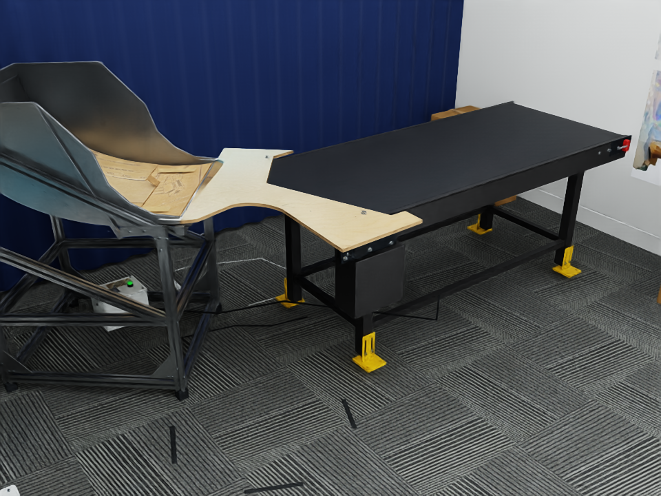

# 基于 Astra 的 Real-to-Sim 场景搭建流程

## Leju 快递分拣工作区效果图



场景文件与打开方式见 [Leju 仿真场景说明](leju_sorting_scene/README.md)。

> 目标：从真实房间/工作台出发，使用 **Polycam 扫描 + Astra 规划与诊断 + Blender 精修 + PBR 材质 + Isaac Sim 物理验收**，得到一个可用于机器人操作、接触和力学实验的仿真环境。
>
> 核心原则：**视觉还原、接触几何、动力学参数必须分开验收。** 场景“看起来像”并不等于“接触正确”，更不等于“物理正确”。

---

## 0. 第一版目标：不要一开始重建整个房间

建议先做最小闭环：

- 1 张桌子
- 1 个箱子或目标物体
- 必要时再加 1 个容器/障碍物
- 1 个固定相机或机器人头部相机视角

第一版只证明下面这件事可以重复完成：

> **发现具体误差 → 判断误差来源 → 修改正确变量 → 在独立视角/物理测试中验收。**

只有这个闭环跑通后，再批量扩展到完整房间。

---

# 1. 总体流程

```text
真实场景
  ↓
Polycam 扫描 + 原始照片/深度/位姿保存
  ↓
建立“不可修改的实测参考”
  ↓
Astra 解析场景、建立物体清单、决定哪些物体需要重建
  ↓
Blender：扫描清理 / 参数化建模 / CAD替换 / 生成式补全
  ↓
几何闭环：真实图像 ↔ 渲染图 ↔ 点云 ↔ 尺寸
  ↓
PBR 材质构建
  ↓
导出 USD / 导入 Isaac Sim
  ↓
Collision / Mass / Friction / COM 等物理属性设置
  ↓
物理验收 + 机器人视角验收
  ↓
冻结版本并记录来源
```

---

# 2. 阶段 A：使用 Polycam 获取真实场景

## 2.1 扫描前准备

扫描前先确定本次场景真正需要保证精度的区域。

例如机器人翻包裹任务中，优先级可以定义为：

### A 级：必须精确

- 桌面高度
- 桌沿位置
- 箱子/包裹尺寸
- 机器人可能接触的把手、边缘、容器
- 机器人工作空间内的障碍物

### B 级：需要视觉接近

- 柜子
- 墙面
- 地面
- 大型固定设备

### C 级：仅作为背景

- 远处杂物
- 天花板细节
- 与操作任务无关的小物体

不要给所有东西同样的建模投入。

---

## 2.2 Polycam 扫描

推荐同时保留三类信息：

1. **照片 / RGB 图像**
2. **扫描 mesh / point cloud**
3. **Raw 数据（如果当前扫描模式允许导出）**

如果后续希望做类似 Lucida 的 Parse—Generate—Place，只有 OBJ 是不够的，因为多视角识别和几何验证还需要：

- RGB
- Depth
- Camera Intrinsics
- Camera Pose
- 图像与扫描坐标之间的变换

因此原则是：

> **不要只保存最终导出的 OBJ。原始数据永远比最终 mesh 更重要。**

---

## 2.3 建议导出文件

建议至少保存：

```text
polycam_capture/
├── raw/                    # Polycam 原始数据（若可导出）
├── images/                 # 原始照片
├── mesh/
│   ├── scene.glb           # 带材质的场景底稿
│   └── scene.obj           # Blender 通用编辑备份
├── pointcloud/
│   └── scene.ply           # 几何参考
└── metadata/
    ├── camera_intrinsics.*
    ├── camera_poses.*
    └── alignment_transform.*
```

Polycam 当前支持包括 GLB、OBJ、FBX、PLY 等导出格式。工程上建议：

- **GLB**：优先作为“带材质、较完整”的视觉底稿
- **OBJ**：作为 Blender 中通用编辑备份
- **PLY**：作为点云/几何比对参考
- **Raw**：若可以取得，必须单独保留

不要把 STL 作为主要场景格式，因为它基本只保留几何，不适合材质和场景信息传递。

---

# 3. 阶段 B：建立不可修改的 Ground Truth Reference

这是整个流程最重要的一步之一。

Polycam 重建结果本身有误差，因此扫描 mesh **不能直接被当作绝对真值**。

需要额外保存一份“现实世界约束”。

## 3.1 至少人工测量

建议使用卷尺、游标卡尺或激光测距仪测量：

```text
桌面高度
桌面长宽
箱子长宽高
桌沿厚度
关键容器尺寸
机器人基座与桌子的相对位置
固定相机高度
```

例如：

```yaml
table:
  height: 0.742 m
  width: 1.600 m
  depth: 0.800 m

box_001:
  width: 0.315 m
  depth: 0.224 m
  height: 0.186 m
```

这些尺寸后续属于“锁定变量”。

Astra 不应该为了让渲染图看起来更像，而随意修改这些已经实测的值。

---

## 3.2 建立场景坐标系

统一规定：

```text
World Frame:
Z = Up
X = 场景前方
Y = 场景左/右
Unit = meter
```

实际采用哪一方向并不重要，重要的是整个系统统一。

需要记录：

```text
T_polycam_to_world
T_blender_to_world
T_isaac_to_world
```

如果整个场景在 Blender 或 Isaac 中出现统一的旋转、镜像、翻转或尺度问题：

> 优先检查坐标转换和单位，而不是逐件移动家具补偿。

---

# 4. 阶段 C：导入 Blender，保留原始扫描层

在 Blender 中建议建立如下 Collection：

```text
Scene
├── REF_SCAN_LOCKED
├── RECON_OBJECTS
├── COLLISION
├── LIGHTS
├── CAMERAS
└── DEBUG
```

其中：

### REF_SCAN_LOCKED

保存 Polycam 原始扫描。

原则：

> **永远不要直接修改这一层。**

它只是现实参考。

### RECON_OBJECTS

存放最终要进入 Isaac Sim 的独立资产。

例如：

```text
room_wall
floor
workbench
box_001
container_001
cabinet_001
```

---

# 5. 阶段 D：Astra 建立 Persistent Object Registry

Astra 不应该只看到“一整个场景 mesh”。

需要把场景转换成一个持久的对象清单。

建议使用：

```yaml
object_id: box_001
category: cardboard_box
role: manipulation_target

reference:
  images:
    - img_0123.jpg
    - img_0127.jpg
  pointcloud: box_001.ply
  scan_mesh: box_001_scan.obj

geometry:
  width: 0.315
  depth: 0.224
  height: 0.186
  dimension_source: manual_measurement

pose:
  frame: world
  xyz: [1.14, 0.42, 0.742]
  rpy: [0.0, 0.0, 1.57]

model:
  source: parametric
  file: assets/box_001.blend

observability:
  measured_regions:
    - front
    - top
  inferred_regions:
    - bottom
    - back

physics:
  mass: UNKNOWN
  friction_static: UNKNOWN
  friction_dynamic: UNKNOWN
  center_of_mass: UNKNOWN

status:
  geometry_verified: false
  material_verified: false
  collision_verified: false
  physics_verified: false
```

这样 Astra 修改的单位始终是：

> `object_id + parameter + coordinate frame + numeric value`

而不是：

> “把那个箱子再往左一点”。

---

# 6. 阶段 E：Astra 的 Parse—Generate—Place 思路

这里借鉴 Lucida，但不假设已经复现 Lucida。

## 6.1 Parse

Astra 根据：

- 多视角照片
- Polycam mesh
- 局部 point cloud
- 空间位置
- 已知尺寸

得到：

```text
房间
├── 桌子
├── 箱子
├── 柜子
├── 地面
└── 其他物体
```

并为每个物体建立独立 ID。

---

## 6.2 Generate

每个物体选择一种建模路线。

优先级建议：

```text
真实 CAD
   ↓
实测尺寸参数化建模
   ↓
扫描 mesh 修复
   ↓
合适的现成资产 + 尺寸修正
   ↓
生成式 3D 补全
```

不要默认所有物体都需要 AI 生成。

对于桌子、箱子、柜子等简单几何体：

> **参数化建模通常比生成模型可靠得多。**

生成模型更适合：

- 复杂曲面
- 无 CAD 的设备
- 大量遮挡
- 未观测背面需要合理补全

但需要明确：

> 生成出来的背面只是 plausible geometry，不是实测 geometry。

---

## 6.3 Place

资产生成后放回扫描场景。

每个对象允许 Astra 修改：

```text
Tx Ty Tz
Rx Ry Rz
Sx Sy Sz
```

即 9 DoF 编辑。

但如果某个尺寸已经由人工测量确定，应锁定对应 Scale，避免 Astra 用缩放去补偿位姿错误。

---

# 7. 阶段 F：几何闭环

这是 Astra 最核心的工作。

每次迭代同时生成四类证据：

```text
1. 真实照片
2. 同相机参数的 Blender / Isaac 渲染图
3. Real / Sim Overlay
4. 局部 Point Cloud / Mesh 对比
```

---

## 7.1 相机必须先固定

必须确认：

- Intrinsics
- Distortion（如果保留）
- Camera Pose
- Resolution
- FOV

如果相机本身错了，Astra 很容易通过修改物体来“补偿”相机误差。

因此：

> **相机确认后锁定。**

---

## 7.2 Astra 每轮诊断顺序

不要看到画面不对就直接移动物体。

必须按以下顺序判断：

```text
误差出现
  ↓
相机是否错误？
  ↓ No
全局坐标 / unit 是否错误？
  ↓ No
Object Pose 是否错误？
  ↓ No
Object Geometry 是否错误？
  ↓ No
Material / Lighting 是否导致视觉错觉？
```

---

## 7.3 建议计算的误差

### 尺寸误差

```text
E_size = |L_sim - L_real|
```

### 点云距离

```text
Chamfer Distance
Point-to-Mesh Distance
```

### 图像轮廓误差

```text
IoU(real_mask, sim_mask)
```

### 深度误差

```text
E_depth = mean(|D_real - D_sim|)
```

机器人接触区域的误差阈值应该比背景区域严格得多。

例如：

```text
背景墙：厘米级可以接受
桌面：毫米~厘米级，需要根据任务决定
插接 / 精细接触区域：需要进一步局部重建
```

---

# 8. 阶段 G：删除“幽灵物体”

这是 Real-to-Sim 很常见的问题。

假设 Polycam 扫描中已经存在一个箱子，后来又加入了 `box_001` 独立模型。

如果不处理原扫描：

```text
scan_box
+ reconstructed_box
= 两个箱子重叠
```

更危险的是：

视觉上只看到新箱子，但旧 mesh collision 还存在。

结果机器人会：

- 在空气里碰到东西
- 抓不到视觉上看到的表面
- 出现无法解释的 contact force

因此替换一个物体时必须同时处理：

```text
Visual Removal
Collision Removal
```

并在 Isaac 中再次检查 Scene Graph。

---

# 9. 阶段 H：PBR 材质

## 9.1 为什么 Polycam 照片纹理不能直接等同于真实材质

Polycam 照片记录的是：

> 当时灯光条件下物体“看起来是什么样”。

它同时混合：

```text
真实颜色
阴影
高光
反射
曝光
白平衡
```

如果直接作为 Base Color，再放进新的光照环境：

```text
旧阴影 + 新阴影
旧高光 + 新高光
```

会产生不自然结果。

PBR 的目标是把材质属性拆开。

---

## 9.2 PBR 常见贴图

### Base Color

描述材料本身颜色和花纹。

### Roughness

描述微表面粗糙度。

影响：

- 高光大小
- 高光锐度
- 反射模糊程度

### Metallic

描述是否按金属方式反射。

多数：

```text
塑料 = 0
木头 = 0
纸箱 = 0
金属 = 1
```

### Normal

描述微小表面方向变化。

注意：

> Normal Map 不会真正改变 collision geometry。

### Height / Displacement

描述真实高度变化。

只有在实际 displacement / tessellation 或几何处理后，才可能改变可见几何。

---

# 10. PBR 工具分工

## 普通背景材质

优先：

```text
Poly Haven
ambientCG
```

适合：

- 墙面
- 普通地砖
- 木头
- 金属
- 常见塑料

---

## 特殊真实表面

例如：

- 防静电桌面
- 特殊橡胶地板
- 定制柜体
- 特殊包装材料

可以拍摄真实表面，然后使用：

```text
Adobe Substance 3D Sampler
```

从照片推断：

```text
Base Color
Roughness
Normal
Height
```

但必须记住：

> 单张/少量照片中的材质—光照分解存在先天歧义，因此它不是精密物理测量。

---

## 局部精细绘制

使用：

```text
Substance 3D Painter
```

适合：

- 污渍
- 标签
- 磨损
- 划痕
- 机器人频繁观察的局部区域

第一版不建议全面使用 Painter。

---

# 11. 推荐的材质投入策略

采用三级投入：

### Level 1：背景

```text
现成 PBR
+ 调颜色
+ 调 UV Scale
+ 调 Roughness
```

### Level 2：场景重要物体

```text
Polycam Texture
+ PBR 替换/修正
+ 实拍颜色参考
```

### Level 3：机器人接触/近距离观察区域

```text
定制 PBR
+ 局部 Painter
+ 必要时真实几何细化
```

---

# 12. 阶段 I：先跑通 Blender → USD → Isaac Sim

不要等整个房间做完才第一次导入 Isaac。

先选择：

```text
桌子 + 一个箱子
```

验证完整资产链。

检查：

```text
Scale
Coordinate System
Texture Path
UV
Material
Normal Map
Transparency
USD hierarchy
```

确认一套资产能稳定进入 Isaac 后，再批量处理。

---

# 13. 阶段 J：Isaac Sim 场景结构

建议：

```text
/World
├── Environment
│   ├── Floor
│   ├── Wall
│   └── Table
│
├── Objects
│   ├── Box_001
│   └── Container_001
│
├── Robot
│
├── Sensors
│   └── HeadCamera
│
└── Lights
```

每个重要资产尽量保存为独立 USD：

```text
assets/
├── table/
│   └── table.usd
├── box_001/
│   └── box_001.usd
└── container_001/
    └── container_001.usd
```

最终场景只负责组合这些资产。

这样后续 Astra 可以只修改某一个对象，而不重写整个 Scene USD。

---

# 14. 阶段 K：Collision 建模

视觉 mesh 和碰撞 mesh 不应该默认相同。

### 简单物体

直接使用：

```text
Box Collider
Sphere Collider
Capsule Collider
```

### 中等复杂物体

使用：

```text
Convex Hull
Convex Decomposition
```

### 特殊接触区域

如果任务依赖内部结构，例如：

```text
杯子
箱体
容器
抽屉
```

不能简单用一个整体 Convex Hull。

否则容器内部可能被碰撞体封死。

---

# 15. 阶段 L：物理参数与视觉参数分离

PBR 里的 Roughness 和物理 friction 没有直接等价关系。

例如：

```text
视觉：Roughness = 0.8
```

不能推出：

```text
Physics Friction = 0.8
```

以下参数必须单独设置：

```text
Mass
Center of Mass
Static Friction
Dynamic Friction
Restitution
Compliance
Damping
```

来源需要注明：

```yaml
mass:
  value: 0.82
  source: measured_scale

static_friction:
  value: 0.46
  source: estimated_from_push_test
```

禁止出现：

```yaml
mass: 1.0
source: made_simulation_work
```

除非该场景本身就是 domain randomization 实验，并明确把它当作随机参数。

---

# 16. 阶段 M：物理验收

## Test 1：静置测试

箱子放桌面：

```text
✓ 不穿透
✓ 不悬浮
✓ 不持续抖动
✓ 不缓慢漂移
```

---

## Test 2：碰撞测试

机器人或测试物体接近桌面：

```text
视觉接触位置 ≈ Physics Contact 位置
```

如果机器人距离桌面还有 2 cm 就产生 contact：

说明 collision geometry 有问题。

---

## Test 3：容器测试

将小物体放入容器：

```text
✓ 能进入内部
✓ 不被 invisible convex hull 挡住
```

---

## Test 4：替换物体测试

删除 / 搬走箱子后：

```text
✓ 原位置不存在 collision
✓ 不存在 invisible obstacle
```

---

## Test 5：机器人视角测试

从机器人真实使用的 camera pose 渲染。

重点检查：

```text
桌沿
目标物体
遮挡关系
机器人手附近接触面
```

而不是只看第三人称漂亮截图。

---

# 17. Astra 的自动迭代逻辑

可以把 Astra 的行为设计成如下循环：

```text
while not verified:

    Observe(
        real_images,
        rendered_images,
        overlays,
        pointcloud_error,
        physical_test_result
    )

    Diagnose(error_source)

    if error_source == CAMERA:
        fix_camera()

    elif error_source == GLOBAL_TRANSFORM:
        fix_coordinate_transform()

    elif error_source == OBJECT_POSE:
        adjust_pose(object_id, xyz, rpy)

    elif error_source == OBJECT_GEOMETRY:
        edit_geometry(object_id, parameters)

    elif error_source == MATERIAL:
        adjust_material(object_id, pbr_parameters)

    elif error_source == COLLISION:
        rebuild_collision(object_id)

    elif error_source == PHYSICS:
        update_physical_parameter(
            only_if_measurement_or_test_supports_it
        )

    Evaluate()

    if new_score < previous_best_score:
        rollback_to_best_version()
```

关键不是“让 Astra 一直改”，而是要求它：

```text
Observe
→ Diagnose
→ Act
→ Evaluate
→ Keep / Rollback
```

---

# 18. 停止条件

没有停止条件的自动修改非常容易无限循环。

每个对象建议设定：

```yaml
geometry:
  dimension_error_max: 0.005 m
  surface_error_max: 0.010 m

vision:
  mask_iou_min: 0.95

physics:
  penetration_max: 0.002 m
  stable_time: 10 s
```

具体阈值根据任务调整。

如果连续 N 次修改没有改善：

```text
STOP
```

并输出：

```text
当前无法通过已有观测确定该参数。
需要：
- 补拍背面
- 测量尺寸
- 称重
- 进行推力实验
```

这比继续“猜”正确得多。

---

# 19. 版本管理

建议：

```text
scene_v001_scan_import
scene_v002_table_rebuilt
scene_v003_box_aligned
scene_v004_material_pass
scene_v005_collision_pass
scene_v006_physics_verified
```

每次 Astra 修改前保存：

```text
before
change
reason
metric_before
metric_after
```

例如：

```yaml
change_id: 0042
object: box_001
parameter: pose.x
before: 1.142
new: 1.136
reason: silhouette shifted +6 mm in two calibrated views
metric_before: 0.921 IoU
metric_after: 0.956 IoU
accepted: true
```

---

# 20. 推荐目录结构

```text
real2sim_project/
│
├── 00_raw/
│   ├── polycam/
│   ├── images/
│   ├── depth/
│   └── camera/
│
├── 01_reference/
│   ├── measurements.yaml
│   ├── coordinate_frames.yaml
│   └── reference_pointcloud.ply
│
├── 02_blender/
│   ├── master_scene.blend
│   └── objects/
│
├── 03_assets/
│   ├── table/
│   ├── box_001/
│   └── container_001/
│
├── 04_textures/
│   ├── pbr_library/
│   └── custom/
│
├── 05_usd/
│   ├── assets/
│   └── scenes/
│
├── 06_isaac/
│   ├── scripts/
│   ├── physics_materials/
│   └── tests/
│
├── 07_astra/
│   ├── object_registry.yaml
│   ├── action_log/
│   └── evaluations/
│
└── 08_reports/
    ├── geometry_report.md
    ├── material_report.md
    └── physics_report.md
```

---

# 21. 第一阶段实际执行清单

如果现在开始做，建议严格按下面顺序。

## Step 1

选择一个最小真实场景：

```text
桌子 + 箱子
```

## Step 2

Polycam 扫描。

保存：

```text
GLB
OBJ
PLY
Raw（如果可获取）
照片
相机信息
```

## Step 3

人工测量：

```text
桌面高度
桌面长宽
箱子长宽高
```

写入：

```text
measurements.yaml
```

## Step 4

导入 Blender。

保留原扫描：

```text
REF_SCAN_LOCKED
```

## Step 5

将桌子和箱子从 scan 中分离出来。

建立：

```text
table_001
box_001
```

## Step 6

对于桌子和箱子，优先根据实测尺寸重新参数化建模。

不要首先尝试生成式 3D。

## Step 7

将新模型叠加回 point cloud。

修正：

```text
Pose
Rotation
Scale（只允许未锁定轴）
```

## Step 8

建立一个真实相机视角。

生成：

```text
real.png
sim.png
overlay.png
```

## Step 9

让 Astra 判断误差来源并输出明确动作，例如：

```json
{
  "object_id": "box_001",
  "operation": "set_transform",
  "frame": "world",
  "translation": [1.136, 0.418, 0.835],
  "rotation_rpy": [0.0, 0.0, 1.565]
}
```

本地脚本通过 Blender Python API 执行。

## Step 10

重复：

```text
Render → Compare → Diagnose → Modify → Evaluate
```

直到几何验收。

## Step 11

给桌面和箱子添加最简单的 PBR。

第一版使用：

```text
Poly Haven / ambientCG
```

先保证：

```text
颜色大致正确
纹理尺度正确
Roughness 合理
```

不要先追求划痕、污渍等细节。

## Step 12

导出 USD，并导入 Isaac Sim。

先检查：

```text
Scale
Pose
Material
Texture
```

## Step 13

添加 Collision。

```text
Table → simple collision
Box → box / convex collision
```

## Step 14

设置基础物理属性。

优先使用真实测量值。

不知道的参数标记为：

```text
UNKNOWN
```

而不是随便填写。

## Step 15

运行五类验收：

```text
静置
碰撞
搬走物体
机器人相机
基本推动
```

## Step 16

保存：

```text
scene_v001_verified.usd
```

此时才进入更多家具和完整房间构建。

---

# 22. 第一阶段暂时不要做的事情

为了避免项目过早复杂化，第一版暂时不要：

```text
✗ 重建整个实验室
✗ 给所有物体制作高级 Substance 材质
✗ 对所有物体做生成式 3D 补全
✗ 直接训练一个 Lucida 等级的模型
✗ 一开始就自动调质量、摩擦等所有物理参数
✗ 用视觉相似度代替碰撞验收
✗ 用一个扫描 mesh 同时承担视觉 mesh 和精确 collision mesh
```

---

# 23. 最终目标形态

完整系统最终可以变成：

```text
               ┌──────────────┐
Real Images ──▶│              │
Depth ────────▶│              │
Point Cloud ──▶│    Astra     │
Measurements ─▶│              │
Isaac Tests ──▶│              │
               └──────┬───────┘
                      │
             Structured Action
                      │
          ┌───────────┴───────────┐
          │                       │
   Blender Python            Isaac Sim API
          │                       │
   Geometry / Material      Collision / Physics
          │                       │
          └───────────┬───────────┘
                      │
                  Evaluation
                      │
                      └──────▶ Astra
```

Astra 的价值不是替代 Blender 或 Isaac Sim。

它更适合承担：

> **理解多模态证据 → 判断误差属于哪一类 → 决定应该修改哪个对象的哪个参数 → 调用确定性的工具执行 → 根据新证据决定接受、回退或继续。**

也就是说，它更像整个 Real-to-Sim 流程的 **controller / harness**。

---

# 24. 完成场景时必须一起保存的内容

最终不能只留下一个 `.usd`。

至少保存：

```text
✓ .blend 源文件
✓ USD 场景
✓ 独立 USD 资产
✓ PBR 贴图
✓ Polycam 原始扫描
✓ Point Cloud
✓ 原始照片
✓ Camera Intrinsics
✓ Camera Poses
✓ 坐标转换
✓ 人工测量尺寸
✓ Object Registry
✓ Mass / Friction 等物理参数来源
✓ Astra 修改日志
✓ Geometry Test Report
✓ Physics Test Report
```

这样这个场景才是真正可追溯、可修改、可用于论文实验的仿真资产，而不仅仅是一个“看起来很像的 3D 房间”。

---

# 25. 一句话版流程

> **Polycam 用来取得真实世界的观测底稿；Blender 用来把不可控的扫描 mesh 变成独立、干净、可编辑的资产；PBR 用来恢复可重新打光的表面属性；Astra 负责根据真实观测持续诊断和调用工具修改；Isaac Sim 最终负责验证机器人真正看到、碰到和推动的是否与真实场景一致。**
