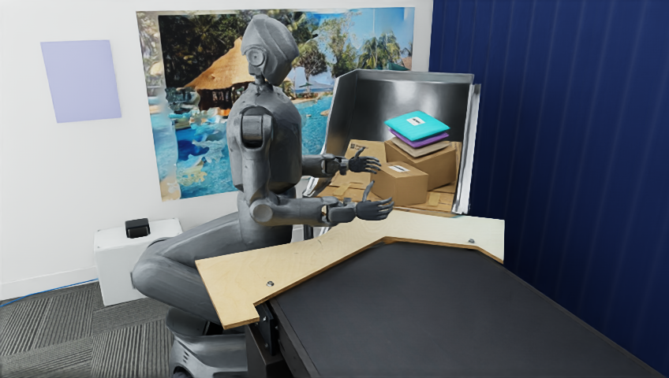

# Leju 机器人与动态包裹场景

这是服务器 `leju_closed_loop_photo_v2` 的场景资产，叠加在同仓库的 [Leju 工作区](../leju_sorting_scene/README.md) 上。`scene.usda` 包含关节式机器人、两只纸箱和三只快递袋；包裹在 USD 中是动态刚体。`scene_robot_only.usda` 是无包裹的机器人版本。

## 打开与编辑

- 在 Isaac Sim 4.5 中打开 `scene.usda`。它相对引用 `../leju_sorting_scene/exports/aligned_neutral.usda`，因此请保留仓库目录结构。单独引用机器人可使用 `assets/robot.usda`；包裹资产位于 `assets/parcels/`。
- 在 Blender 4.5 中打开 `leju_photo_v2.blend` 编辑完整视觉场景，或打开 `parcels.blend` 编辑包裹。大于 GitHub 单文件限制的完整工程存于 Git LFS；克隆时需要安装 Git LFS 并运行 `git lfs pull`。
- `assets/leju_5w_revo2.urdf` 和 `assets/meshes/` 提供机器人网格与 URDF 源资产。`assets/robot_config.json` 保存初始关节、手部和相机参数。

## 验证边界

预览来自原服务器已保存的初始场景。该版本原有报告确认五个动态包裹及碰撞体存在，包裹在 12 秒仿真中保持稳定；此前闭环试验**没有完成包裹搬运**。迁移后的 `scene.usda` 已在原服务器的 Isaac Sim 4.5 中完成 USD 组合检查：机器人与包裹 prim 可访问，没有未解析的资产路径。策略闭环与实机动作不在本仓库内，也不宣称已在新机器运行。

腕部相机外参根据照片拟合，未经过实测手眼标定。包裹尺寸、质量、摩擦、标签及软袋刚体代理均为建模近似。输送带没有驱动。
